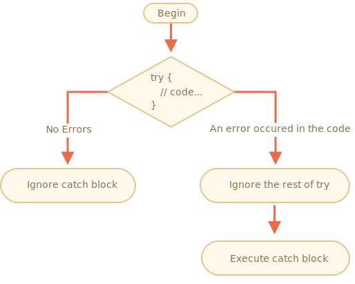

# Error handling, "try..catch"

No matter how great we are at programming, sometimes our scripts have errors. They may occur because of our mistakes, an unexpected user input, an erroneous server response, and for a thousand other reasons.

Usually, a script "dies" (immediately stops) in case of an error, printing it to console.

But there's a syntax construct `try..catch` that allows to "catch" errors and, instead of dying, do something more reasonable.

## The "try..catch" syntax

The `try..catch` construct has two main blocks: `try`, and then `catch`:

```js
try {

  // code...

} catch (err) {

  // error handling

}
```

It works like this:

1. First, the code in `try {...}` is executed.
2. If there were no errors, then `catch(err)` is ignored: the execution reaches the end of `try` and goes on, skipping `catch`.
3. If an error occurs, then `try` execution is stopped, and the control flows to the beginning of `catch(err)`. The `err` variable (can use any name for it) will contain an error object with details about what happened.



So, an error inside the `try {…}` block does not kill the script: we have a chance to handle it in `catch`.

Let's see examples.

- An errorless example: shows `alert` `(1)` and `(2)`:

    ```js run
    try {

      alert('Start of try runs');  // (1) 

      // ...no errors here

      alert('End of try runs');   // (2) 

    } catch(err) {

      alert('Catch is ignored, because there are no errors'); // (3)

    }
    ```
- An example with an error: shows `(1)` and `(3)`:

    ```js run
    try {

      alert('Start of try runs');  // (1)

   
      lalala; // error, variable is not defined!
   

      alert('End of try (never reached)');  // (2)

    } catch(err) {

      alert(`Error has occurred!`); // (3) *

    }
    ```

The `try..catch` can only handle errors that occur in the valid code. Such errors are called "runtime errors" or, sometimes, "exceptions".


## Error object

When an error occurs, JavaScript generates an object containing the details about it. The object is then passed as an argument to `catch`:

```js
try {
  // ...
} catch(err) { // <-- the "error object", could use another word instead of err
  // ...
}
```

For all built-in errors, the error object has two main properties:

`name`
: Error name. For instance, for an undefined variable that's `"ReferenceError"`.

`message`
: Textual message about error details.

There are other non-standard properties available in most environments. One of most widely used and supported is:

`stack`
: Current call stack: a string with information about the sequence of nested calls that led to the error. Used for debugging purposes.

For instance:

```js run untrusted
try {
*!*
  lalala; // error, variable is not defined!
*/!*
} catch(err) {
  alert(err.name); // ReferenceError
  alert(err.message); // lalala is not defined
  alert(err.stack); // ReferenceError: lalala is not defined at (...call stack)

  // Can also show an error as a whole
  // The error is converted to string as "name: message"
  alert(err); // ReferenceError: lalala is not defined
}
```


## Example "try..catch"

Let's explore a real-life use case of `try..catch`.

JavaScript supports the [JSON.parse(str)](mdn:js/JSON/parse) method to read JSON-encoded values.

Usually it's used to decode data received over the network, from the server or another source.

We receive it and call `JSON.parse` like this:

```js run
let json = '{"name":"John", "age": 30}'; // data from the server


let user = JSON.parse(json); // convert the text representation to JS object


// now user is an object with properties from the string
alert( user.name ); // John
alert( user.age );  // 30
```

Should we be satisfied with that? Of course not!

This way, if something's wrong with the data, the visitor will never know that (unless they open the developer console). And people really don't like when something "just dies" without any error message.

Let's use `try..catch` to handle the error:

```js run
let json = "{ bad json }";

try {

  let user = JSON.parse(json); // <-- when an error occurs...

  alert( user.name ); // doesn't work

} catch (e) {

  // ...the execution jumps here
  alert( "Our apologies, the data has errors, we'll try to request it one more time." );
  alert( e.name );
  alert( e.message );

}
```

Here we use the `catch` block only to show the message, but we can do much more: send a new network request, suggest an alternative to the visitor, send information about the error to a logging facility, ... . All much better than just dying.

Like, throwing our own errors.

```js run
let json = '{ "age": 30 }'; // incomplete data

try {

  let user = JSON.parse(json); // <-- no errors
  alert( user.name ); // no name!

} catch (e) {
  alert( "doesn't execute" );
}
```

Here `JSON.parse` runs normally, but the absence of `name` is actually an error for us.


## try..catch..finally

The `try..catch` construct may have one more code clause: `finally`.

If it exists, it runs in all cases:

- after `try`, if there were no errors,
- after `catch`, if there were errors.

The extended syntax looks like this:

```js
try {
   ... try to execute the code ...
} catch(e) {
   ... handle errors ...
} finally {
   ... execute always ...
}
```

Try running this code:

```js run
try {
  alert( 'try' );
  if (confirm('Make an error?')) BAD_CODE();
} catch (e) {
  alert( 'catch' );
} finally {
  alert( 'finally' );
}
```

The code has two ways of execution:

1. If you answer "Yes" to "Make an error?", then `try -> catch -> finally`.
2. If you say "No", then `try -> finally`.

The `finally` clause is often used when we start doing something and want to finalize it in any case of outcome.


## Global catch


Let's imagine we've got a fatal error outside of `try..catch`, and the script died. Like a programming error or some other terrible thing.

Is there a way to react on such occurrences? We may want to log the error, show something to the user (normally they don't see error messages), etc.


The syntax:

```js
window.onerror = function(message, url, line, col, error) {
  // ...
};
```

`message`
: Error message.

`url`
: URL of the script where error happened.

`line`, `col`
: Line and column numbers where error happened.

`error`
: Error object.

For instance:

```html run untrusted refresh height=1
<script>
*!*
  window.onerror = function(message, url, line, col, error) {
    alert(`${message}\n At ${line}:${col} of ${url}`);
  };
*/!*

  function readData() {
    badFunc(); // Whoops, something went wrong!
  }

  readData();
</script>
```
